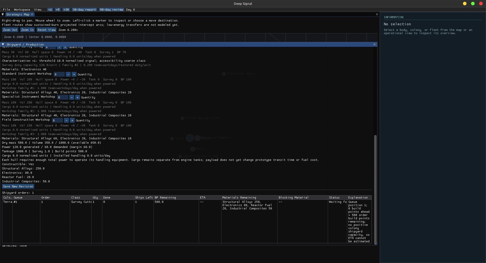
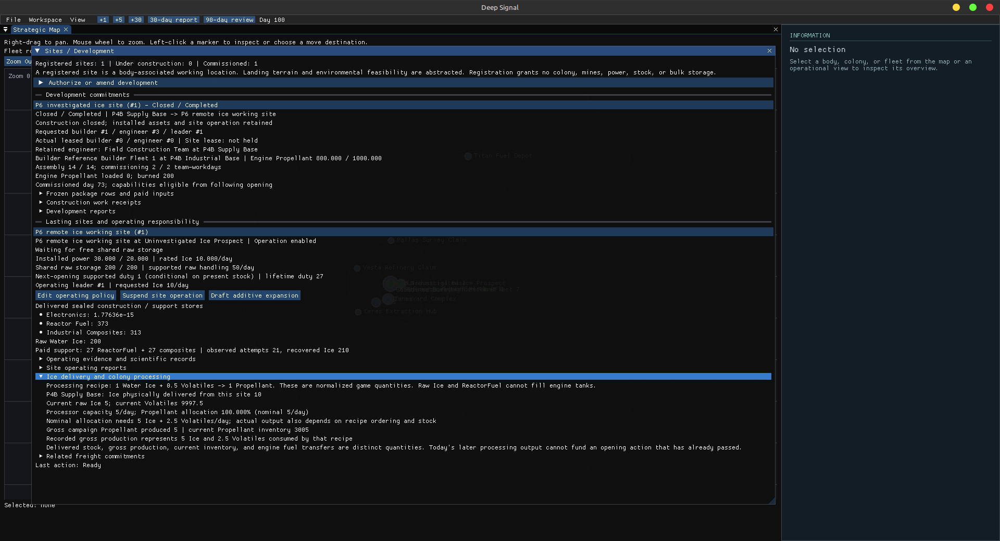
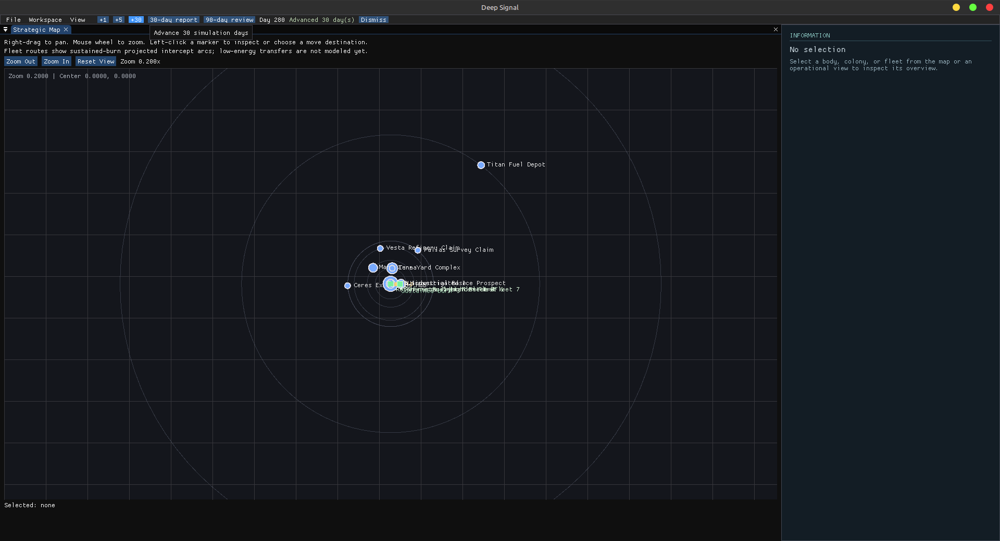

# P6 native UI evidence

Status: native diagnostic capture complete; owner review of the evidence and
remediation scope remains open. This branch contains evidence only and does
not establish P6 acceptance.

| Metadata | Recorded value |
| --- | --- |
| Evidence branch | `p6-ui-evidence` |
| P6 UI evidence commit | `42bfaaab18f3393138c5f6757e0e5a4a0a29d68a` contains the complete screenshot/session/finding artifacts. The final provenance-only branch head is recorded in the handback. |
| Source gameplay/UI head | `f0f11672238b5edc70f72a607644b2d2abc447dd` |
| Evidence branch SHA at capture start | Same as source head; final evidence commit is recorded in the handback. |
| OS | Linux Mint 22.1 Xia, Linux 6.8.0-139-generic |
| Desktop/session | Active local Cinnamon session `c1`, seat0/tty7 |
| Display backend | Native Xorg/X11 `:0`, not a virtual or dummy display |
| Physical resolution | 1920 × 1080, HDMI-0, 60 Hz |
| UI scaling | Cinnamon scaling-factor 0 (automatic); text-scaling-factor 1.0 |
| Host graphics | NVIDIA GeForce RTX 2070 SUPER; host OpenGL 4.6 NVIDIA 580.178.04. App renderer was not separately introspected. |
| Native window | Initially 1280 × 720 client; maximized to 1920 × 1012 client after first capture. PNGs retain native resolution and title frame. |
| Build directory | `build-p6-ui`; existing build succeeded with no work required. CLI build likewise current. |
| SDL3 configuration | UI ON; SDL3_DIR `/home/daniel/.local/deep_signal_deps/sdl3/lib/cmake/SDL3`; CMake build type unset. |
| Reviewer | Codex using real native X11 input and window screenshots; independent screenshot-only H0 crosscheck. |
| Date | 2026-09-30, America/Denver |
| Fresh review pack | `/tmp/deep-signal-p6-ui-evidence-f0f1167` |
| Review-pack generating commit | `f0f11672238b5edc70f72a607644b2d2abc447dd` |
| PR #15 | Verified open/unmerged at source head before capture. |

The initial shell had no DISPLAY variable, but host inspection identified an
active native Cinnamon session. The app was launched using that session's
observed display and authorization settings. No alternative/offscreen display
was created. Each accepted PNG was opened and inspected after capture.

The reviewer has prior project context. During this session navigation is
guided by the visible UI, without reading gameplay/UI source to locate controls.
This is a diagnostic native walkthrough, not an independent novice playtest or
an acceptance claim.

Capture window: 09:37:33–10:07:45 America/Denver, 30 minutes 12 seconds.
The native app instance closed normally at 10:10:43. Fresh pack hashes are in
[review-pack-sha256.txt](review-pack-sha256.txt). Input save modification times
remained at generation; no save was overwritten during the walkthrough.

## Exercise results

These labels describe the diagnostic task, not milestone acceptance.

| Exercise | Result | Findings / observation |
| --- | --- | --- |
| H0 — orientation | Friction | UI-001, UI-002: date/control hints clear; operational orientation and table reading require exploration. |
| H1 — durable waiting intent | Friction | UI-002, UI-003: real wait found below the long editor; capacity cause and absent ETA are honest. |
| H2 — design choice | Friction | UI-004, UI-005: real tradeoffs visible; serial comparison and contradictory completed-order remaining demand impede reading. |
| H3 — blind development | Friction | UI-006: selected body must be chosen again; preview remains available without evidence and preserves uncertainty. |
| H4 — evidence distinctions | Friction | UI-007: records and provenance agree, but the dossier is a long repetitive scan. An initial reviewer misreading was corrected before publication. |
| H5 — acknowledgment | Friction | UI-008: response found after panel search; one acknowledgment allowed Day 58→68 without repeated demand or fabricated output. |
| H6 — lasting capability | Pass | Site, freight delivery and gross Propellant consequence are joined and understandable in the existing panel. |
| H7 — delegated 90 days | Friction | Day 190→280 completed in three +30 requests with zero mandatory interventions/daily dispatch; UI-009 affects report inspection. |
| Workspace follow-up | Friction | UI-010: Production selection opened overlapping retained-size panels after the documented session resizes. |

## Findings summary

All ten retained findings are Class B; five are Major and five are Friction.
No Class A or Class C finding was established. UI-000 is the original owner
hypothesis and is not counted separately.

| ID | Severity | Concrete problem |
| --- | --- | --- |
| UI-001 | Friction | Startup/load does not orient the player to current operational work. |
| UI-002 | Friction | Dense tables clip labels and compress explanations. |
| UI-003 | Major | Existing shipyard orders are buried below the complete design editor. |
| UI-004 | Major | Design comparison requires remembering values across a long editor. |
| UI-005 | Major | Completed orders still show remaining BP/material demand. |
| UI-006 | Friction | Selected body context does not carry into development authoring. |
| UI-007 | Friction | Evidence dossier requires long scans through repeated channel prose. |
| UI-008 | Major | A time stop gives a cause without a route to its affected work/response. |
| UI-009 | Friction | Latest published report is reached through oldest-first prose history. |
| UI-010 | Major | Workspace switch reveals overlapping retained panel layouts in this session. |

See [findings](findings.md) for exact reproduction, expected behavior, impact,
source-knowledge limits and candidate directions. [Session notes](session-01.md)
record the native actions, transitions and intervention counts.

## Immediate recommendation

**The evidence shows cross-window information architecture failure**, alongside
local presentation defects. The data and permitted actions generally exist;
the main difficulty is orientation, selection continuity, finding current work
and routing attention to the relevant response. H6's joined consequence view
is a useful pattern to preserve. Design the next bounded UI remediation handoff
from these findings; no remediation or functional change was performed here.

Small text, clipped columns and overlapping/translucent content are visible
readability risks. Keyboard-only navigation, screen-reader support and measured
contrast were not tested, so no accessibility compliance claim is made.

## Verification and scope

Both `cmake --build build-p6-ui --parallel 2` and the `deep_signal_cli` target
build completed with no work required at the pinned source head. A fresh
review pack was generated successfully. All 37 accepted images were inspected
and their original PNG dimensions checked. Working, staged and committed diff
checks passed; the branch delta is confined to this evidence directory.
The complete CTest suites were not rerun for this documentation/image-only pass.
PR #15's gameplay branch remains the source of the prior automated evidence.

No gameplay/UI source, save schema, constants, scenario rule or automated test
was changed. No remediation PR or P6 merge was performed. This diagnostic pass
provides the evidence for an owner scope decision and makes no P6 acceptance
claim.

## Screenshot inventory

All 37 originals were saved and inspected. `00-startup-overview.png` is
1280 × 748 including the native title frame; the other 36 are 1920 × 1040.
No PNG was rescaled, cropped or annotated. Paths below are relative to this
evidence directory.

| Exercise | Committed PNG paths |
| --- | --- |
| H0 | [00-startup-overview.png](screenshots/00-startup-overview.png), [00-startup-window-menu.png](screenshots/00-startup-window-menu.png) |
| H1 | [01-h1-waiting-intent-overview.png](screenshots/01-h1-waiting-intent-overview.png), [01-h1-panel-collapsed.png](screenshots/01-h1-panel-collapsed.png), [01-h1-waiting-intent-detail.png](screenshots/01-h1-waiting-intent-detail.png), [01-h1-standing-order.png](screenshots/01-h1-standing-order.png) |
| H2 | [02-h2-design-choice-overview.png](screenshots/02-h2-design-choice-overview.png), [02-h2-class-selector.png](screenshots/02-h2-class-selector.png), [02-h2-established-design.png](screenshots/02-h2-established-design.png), [02-h2-design-comparison.png](screenshots/02-h2-design-comparison.png) |
| H3 | [03-h3-blind-development-overview.png](screenshots/03-h3-blind-development-overview.png), [03-h3-target-context.png](screenshots/03-h3-target-context.png), [03-h3-context-not-carried.png](screenshots/03-h3-context-not-carried.png), [03-h3-development-authoring.png](screenshots/03-h3-development-authoring.png) |
| H4 | [04-h4-evidence-overview.png](screenshots/04-h4-evidence-overview.png), [04-h4-raw-observation.png](screenshots/04-h4-raw-observation.png), [04-h4-assessment.png](screenshots/04-h4-assessment.png), [04-h4-assessment-water-ice.png](screenshots/04-h4-assessment-water-ice.png), [04-h4-observation-assessment-operation.png](screenshots/04-h4-observation-assessment-operation.png), [04-h4-operating-evidence.png](screenshots/04-h4-operating-evidence.png) |
| H5 | [05-h5-limitation-overview.png](screenshots/05-h5-limitation-overview.png), [05-h5-time-stopped.png](screenshots/05-h5-time-stopped.png), [05-h5-time-control.png](screenshots/05-h5-time-control.png), [05-h5-acknowledgment.png](screenshots/05-h5-acknowledgment.png), [05-h5-acknowledged-state.png](screenshots/05-h5-acknowledged-state.png), [05-h5-follow-up.png](screenshots/05-h5-follow-up.png) |
| H6 | [06-h6-lasting-capability-overview.png](screenshots/06-h6-lasting-capability-overview.png), [06-h6-supply-consequence.png](screenshots/06-h6-supply-consequence.png), [06-h6-related-freight.png](screenshots/06-h6-related-freight.png) |
| H7 | [07-h7-delegated-overview.png](screenshots/07-h7-delegated-overview.png), [07-h7-day220.png](screenshots/07-h7-day220.png), [07-h7-day250.png](screenshots/07-h7-day250.png), [07-h7-day280.png](screenshots/07-h7-day280.png), [07-h7-period-reports.png](screenshots/07-h7-period-reports.png), [07-h7-latest-report.png](screenshots/07-h7-latest-report.png) |
| Workspace | [08-workspace-menu.png](screenshots/08-workspace-menu.png), [08-production-workspace.png](screenshots/08-production-workspace.png) |

## Selected evidence

H1: the standing order is reached below the long editor; its cause is present
but constrained by the table layout.

H6: the site panel connects delivered Ice, the recipe, gross production and
inventory explicitly.

H7: the third monthly request reaches Day 280 from Day 190 without a mandatory
intervention. The other two dated result images are in the inventory.

