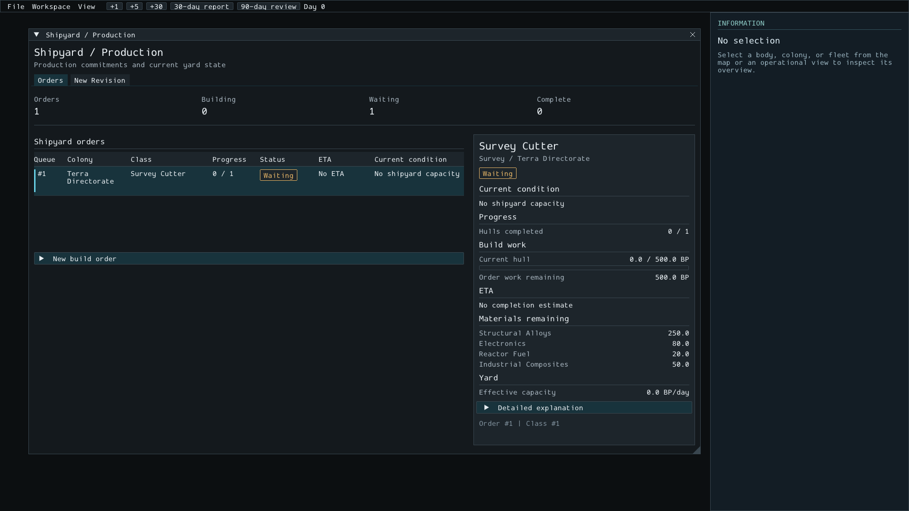
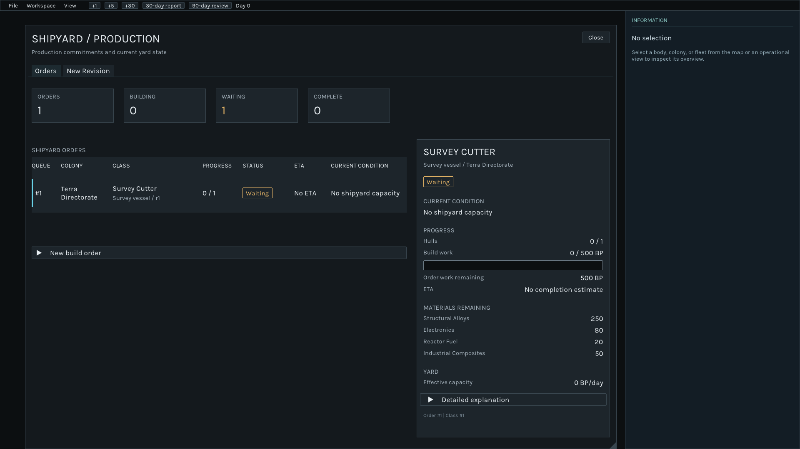
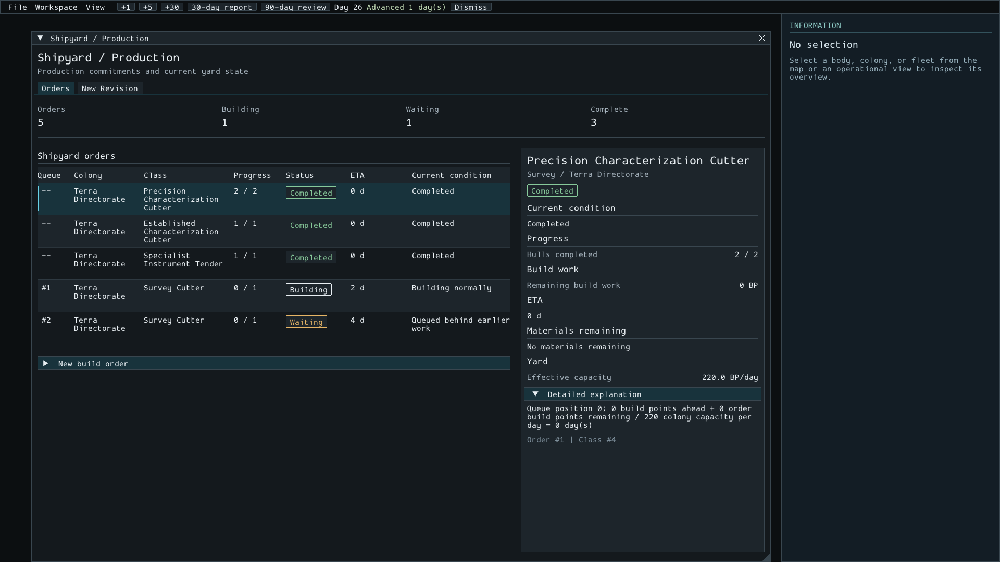
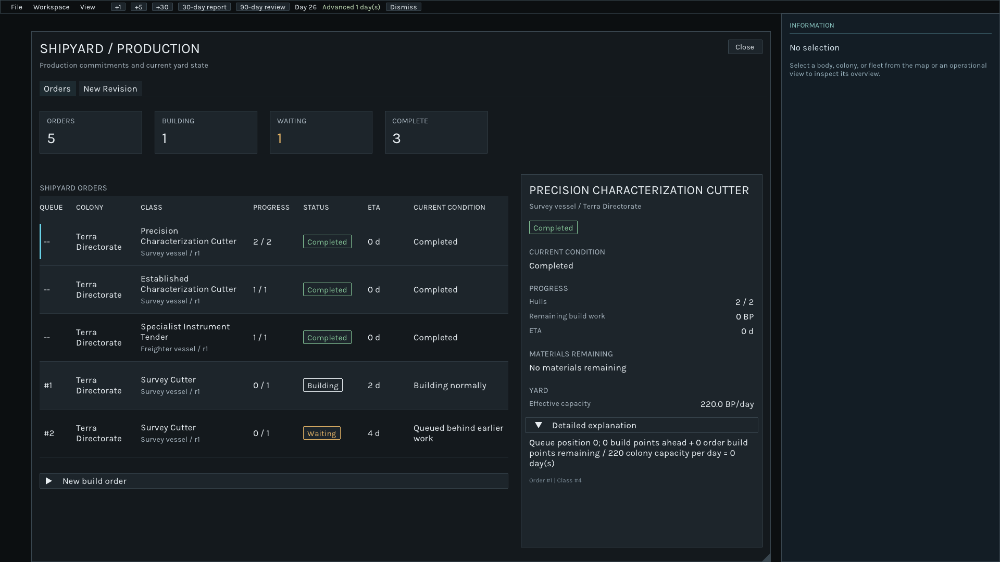
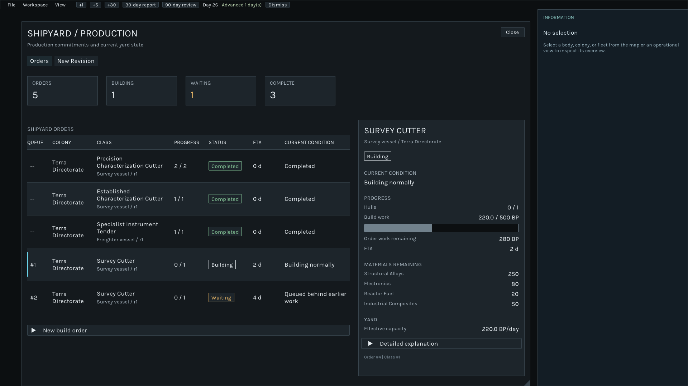

# UI-R1A.1 — Shipyard visual refinement

## Scope and review status

- Revision baseline: `eed22581a1e2c707f5ee09ec9f476c3e8e1f2206`.
- Branch: `p6-ui-readability`; this revision updates the existing PR #16.
- Integrated P6 baseline remains `1698b093a53afffdade4f2a7ae7c0494a38894ca`.
- Owner approval: information architecture and semantic color direction approved;
  this revised visual implementation is **pending owner review**.
- Schema remains v18. This revision changes no app DTO, simulation, or persistence
  code and adds no gameplay behavior.
- The original [UI-R1A report](ui-r1a-report.md), its screenshots, and the
  `p6-ui-evidence` record are preserved as historical evidence.

The owner review established that the Orders hierarchy works but that its visual
scale, typography, progress meter, summary counts, and spacing were not ready to
propagate. This is one presentation revision of that same screen. It retains
Orders first, the table and selection, structured detail, concise conditions,
collapsed diagnostics, secondary New build order, and the separate New Revision
tab. It does not reopen the approved information architecture or UI-005 fix.

## Changes

### Typography and primitives

The theme now defines explicit text roles instead of scaling every element from
one small size. Shipyard opts into these roles; the base font size for existing
panels remains 16 px, with the existing 8 x 5 px frame padding.

| Role | Size |
|---|---:|
| Screen title | 32 px |
| Object title | 28 px |
| Section heading | 18 px |
| Body | 20 px |
| Secondary | 17 px |
| Provenance | 14 px |
| Metric value | 34 px |
| Tab | 20 px |

Karla Regular is embedded unchanged from the pinned Dear ImGui checkout. The
generated font data is shared by the native application and Shipyard submission
tests, so typography does not depend on a runtime asset path or installed system
font. ImGui's built-in vector font supplies missing glyphs, preserving punctuation
used by existing panels. The SIL Open Font License is retained in
`third_party/licenses/Karla-OFL.txt` and copied into the UI build directory.

Titles and section labels use distinct size and case; secondary labels recede
while values remain prominent. Summary counts occupy four compact charcoal
blocks with thin structural borders. Only a nonzero Waiting count gains amber
emphasis. Existing status badge colors remain meaningful and restrained.

The work meter has a 24 px dark track with a visible outline and a neutral filled
portion. A zero-work order therefore has a recognizable empty track; positive
work has visible area as well as a numeric BP value. It still displays the same
app-projected current-hull work and performs no simulation arithmetic.

### Orders and selected detail

- Rows have a 92 px minimum height, with centered cell contents and enough room
  for a class name followed by its role and revision.
- Wrapped names and subtitles contribute to the row's measured input height.
  The selectable also includes vertical cell padding, retaining full-row input.
- The selected fill is reduced to `#1D2A30`; the cyan left edge remains the main
  selection cue.
- Detail uses an object title, quieter role/location subtitle, explicit state,
  separated section labels, aligned values, and stronger progress visualization.
- Build work and ETA sit together under Progress instead of each competing as
  a separate heading. Materials and yard capacity remain independently scannable.
- Whole numbers omit a redundant decimal; non-integral quantities retain one
  decimal. This is display formatting only.
- No activity feed or new information is added to fill empty space.

The floating Shipyard window no longer repeats its title in generic ImGui chrome.
The screen header owns the title and a visible Close action. Title wrapping
reserves the Close button's space. Existing floating-window confinement and
resize behavior remain; existing docking can still display dock tabs.

The initial Shipyard region is now 1420 x 1020, confined to the available work
area. Saved window geometry remains respected. New Revision remains the existing
editor; its quantity-input width is measured from the active font and controls
so larger text does not crowd the value between the decrement/increment buttons.
This is a compatibility adjustment, not an editor redesign.

## Changed files

| Area | Files | Purpose |
|---|---|---|
| Theme | `src/ui_imgui/UiTheme.h/.cpp` | Named typography roles, embedded face and missing-glyph fallback, spacing, reduced selection fill |
| Presentation | `src/ui_imgui/PresentationWidgets.h/.cpp` | Distinct titles, section labels, compact metric blocks, stronger meter, aligned labels and values |
| Shipyard | `src/ui_imgui/ShipyardPanel.cpp` | Larger rows and text, role/revision subtitle, detail spacing, one title and Close action, measured quantity-input width |
| Window helper | `src/ui_imgui/OperationalWindow.h/.cpp` | Optional titlebar suppression; other callers retain their existing default |
| Build/license | `CMakeLists.txt`, `third_party/licenses/Karla-OFL.txt` | Embed the pinned font and retain its license |
| Tests | `tests/shipyard_ui_tests.cpp` | Updated visible headings, input through row padding, retained fallback-glyph coverage |
| Evidence | This report and `screenshots/ui-r1a1-*.png` | Native comparison checkpoint |

## Automated verification

The existing README-based `build-p6` and `build-p6-ui` configurations were reused.
No separate configure command was required; CMake regenerated during the build
after the build-system change. Complete suites ran sequentially because existing
persistence tests share fixed temporary SQLite paths.

```sh
cmake --build build-p6 --parallel 2
ctest --test-dir build-p6 --output-on-failure -j 2
cmake --build build-p6-ui --parallel 2
ctest --test-dir build-p6-ui --output-on-failure -j 2
git diff --check
```

| Check | Result |
|---|---|
| Full headless suite | **56/56 passed**, 36.43 s |
| Full UI-enabled suite before final row-height adjustment | **68/68 passed**, 36.95 s |
| Final UI-enabled suite after row-height/table-height adjustment | **68/68 passed**, 36.94 s |
| Compiler warnings | **None** in project build logs |
| Final diff check | **Passed** |

Headless evidence: `/tmp/ui-r1a1-headless-ctest.log`. Final UI evidence:
`/tmp/ui-r1a1-table-ctest.log`; build log: `/tmp/ui-r1a1-table-build.log`.
These are local checks, not a claim of GitHub Actions verification.

The existing four Shipyard scenarios remain: default Orders and actual tab
navigation; persisted selection without gameplay mutation; failed Load versus
successful world replacement; and selection near the bottom of a long wrapped
class row. The first-row click now targets top padding, covering the enlarged
row's breathing room rather than only its text. A focused font assertion checks
the middle-dot glyph used by existing panels. No color or pixel snapshot test
was added. Submission tests establish content and input behavior; native evidence
is required to judge visual quality.

## Native comparisons

The application ran on the same native 1920 x 1080 desktop canvas used for UI-R1A:
Linux Mint 22.1, Cinnamon/X11, text scaling 1.0. The linked PNGs are original
uncropped, unscaled captures. The images inside the tables may be displayed at a
smaller size by a Markdown viewer; open an image to inspect native pixels.

The waiting comparison changes the floating Shipyard region from 1420 x 900 to
1420 x 1020. Both completed comparisons use a 1420 x 1020 Shipyard region. Thus the
waiting pair compares the actual revised composition, including the taller
screen, rather than holding the old window height constant. The desktop canvas
is 1920 x 1080 in all captures.

The same P6 native-review saves were loaded through the application:
`/tmp/deep-signal-p6-ui-evidence-f0f1167/01-waiting-intent.sqlite` at day 0, and
`02-design-choice.sqlite` at day 25. The completed comparison repeats the earlier
two ordinary Build one commands and one simulation day, reaching day 26. The
Building capture selects that day's first new order without further advancement.
Both source files retained their original SHA-256 values after the session:

```text
01: f251b7eca8fbf7092bef9a40ec7adc785e697637f043f868507687ad580ec81a
02: d3863bbf234f56e0f1fcc26c811bcfd97d58e0e735bea7bfddbb2488c64c8f98
```

All three new PNG headers were verified as 1920 x 1080. The native review
application closed normally with exit 0 and no runtime diagnostic output.

### Waiting order

| UI-R1A | UI-R1A.1 |
|---|---|
| [](screenshots/ui-r1a-orders-waiting-1920x1080.png) | [](screenshots/ui-r1a1-orders-waiting-1920x1080.png) |

The standing Survey Cutter order remains Waiting with no shipyard capacity,
0/1 hulls, 0/500 BP, and no ETA. The revision changes how the condition and work
are presented, while preserving the underlying order and app projection.

### Completed order and mixed current work

| UI-R1A | UI-R1A.1 |
|---|---|
| [](screenshots/ui-r1a-orders-completed-1920x1080.png) | [](screenshots/ui-r1a1-orders-completed-1920x1080.png) |

The comparison retains five commitments and the three visible states: one
Building, one Waiting, and three Complete. The selected completed Precision
Characterization Cutter order remains 2/2 hulls, 0 BP outstanding, no remaining
materials, and ETA 0 d. The earlier UI-005 correction is unchanged.

### Positive progress

[](screenshots/ui-r1a1-orders-building-1920x1080.png)

The additional day-26 Building selection shows 220/500 BP with a visible filled
bar. This exercises the meter beyond the empty-track waiting case; it does not
introduce a new fixture mechanic or progress calculation.

### Native interaction observations

- The explicit Close action and reopening the screen were exercised.
- Free Shift-drag movement and resizing were exercised with the titlebar removed.
- Clicking the top padding of the active row selected it correctly.
- New Revision's quantity values remained visible after the sizing adjustment.
- Orders remains the first operational view, with New Revision separately
  reachable. No authoring content was promoted ahead of current commitments.
- The revised selection treatment, state badges, metric groups, title hierarchy,
  and empty/filled progress tracks are presented for owner review in the captures.

## Limits and stop point

Information architecture and semantic color direction remain approved. Approval
of this visual refinement is pending; the screenshots do not constitute owner
approval or a freeze of the primitives.

The face and shared style naturally affect existing controls, but this revision
does not redesign or claim native usability verification for other panels.
Legacy base control sizing is retained. New Revision remains dense; existing
docked windows can still show dock tabs; the fixed information sidebar and the
shell are unchanged.

No Compare Designs, workspace layout, Operational Summary, Sites, Evidence,
Attention, program-panel, or report/history redesign was started. No simulation,
save schema, app DTO, construction rule, accounting rule, or persisted UI state
changed in this revision. PR #16 remains open and unmerged. Stop here for owner
comparison of this same Shipyard screen before propagating the primitives.
